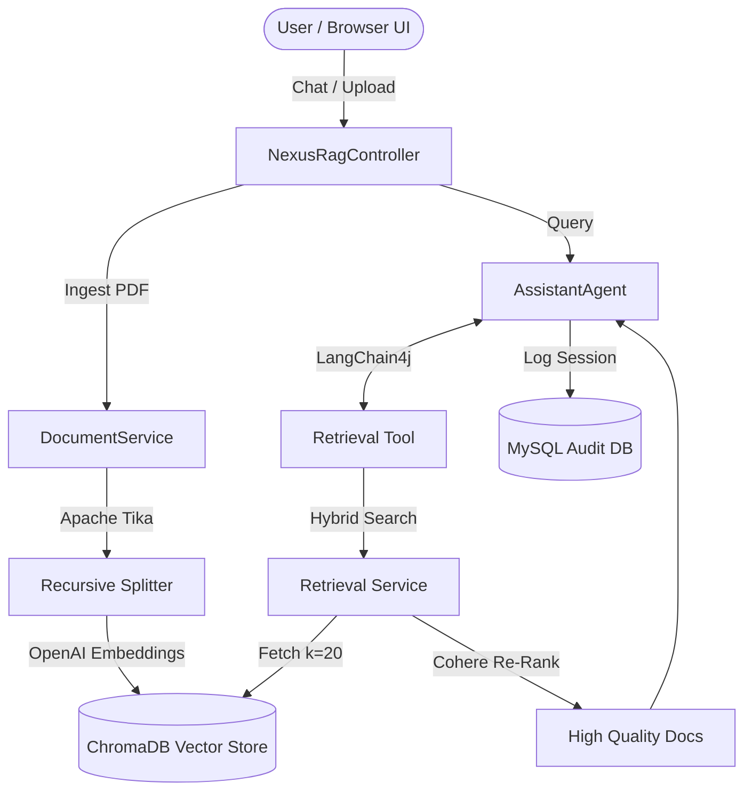

# Nexus RAG Autonomous Assistant

Nexus RAG is a production-grade autonomous university assistant built using Spring Boot, LangChain4j, ChromaDB, and MySQL. It leverages Retrieval-Augmented Generation (RAG) to provide grounded, hallucination-free answers based on uploaded university policies and documents.

## 🌟 Key Features
- **Data Ingestion Pipeline**: Parses PDFs natively using Apache Tika and chunks them dynamically using recursive character splitting.
- **Vector Semantic Search**: Embeds document chunks using OpenAI's `text-embedding-3-small` and stores them in a local ChromaDB instance.
- **Hybrid Search & Re-Ranking**: Filters low-quality matches and re-ranks top results via a Cohere scoring model (Score Threshold: 0.7) to ensure high-accuracy context.
- **Autonomous Agentic Logic**: Built on LangChain4j, the agent independently determines when to leverage its embedded `RetrievalTool` to fetch document contexts.
- **Secure Audit Logging**: All queries, latency metrics, bot responses, and grounded evidence are instantly tracked and securely logged into a MySQL database for administrative review.
- **Premium Graphical User Interface**: A baked-in, dark-mode Glassmorphism frontend UI built using Vanilla HTML/CSS/JS, served seamlessly by the Spring Boot server.

---

## 🏗 System Architecture



---

## 📂 Project Structure
```text
Nexus_Rag/
├── src/main/java/com/nexusrag/
│   ├── agent/            # LangChain4j tools and AI service interfaces
│   ├── config/           # AI model and tool wiring
│   ├── controller/       # REST API endpoints
│   ├── model/            # JPA Entities (UserSession, AuditLog)
│   ├── repository/       # Data Access / JPA Repositories
│   └── service/          # Core Business Logic (Ingestion, Hybrid Search)
├── src/main/resources/
│   ├── db/               # SQL initialization scripts
│   ├── static/           # Premium Web Frontend (HTML, CSS, JS)
│   └── application.properties # Environment configurations
├── src/test/             # Automated Splitting & Threshold Tests
├── docker-compose.yml    # External DB infrastructure
└── pom.xml               # Dependencies
```

---

## 🚀 Setup & Installation

### Prerequisites
Before starting, ensure you have the following installed on your machine:
- **Java 21 (JDK)**
- **Maven**
- **Docker Desktop**
- **OpenAI API Key**

### 1. Launch Infrastructure
Start your ChromaDB vector database and MySQL relational database using Docker. Open your terminal in the project root:
```bash
docker compose up -d
```
> [!NOTE]
> ChromaDB will run on `http://localhost:8000` and MySQL binds to `localhost:3307`.

### 2. Configure Environment Secrets
The application requires your OpenAI API key to power the AI. You can inject this via your environment before running.

**Windows (Command Prompt):**
```cmd
set OPENAI_API_KEY=sk-your-actual-api-key-here
```
**Mac / Linux:**
```bash
export OPENAI_API_KEY=sk-your-actual-api-key-here
```

### 3. Build the Application
Compile the Java code and run the Spring Boot validations:
```bash
mvn clean install
```

### 4. Start the Nexus Server
```bash
mvn spring-boot:run
```

---

## 🖥 Usage Guide

### Accessing the Web UI
The easiest way to use the application is via the integrated Web UI.
Simply open your web browser and navigate to:
**`http://localhost:8080/`**

1. Upload a PDF using the left sidebar menu to populate the Vector Database.
2. Ask questions about the PDF in the Right-Hand chat window. The bot will autonomously search the DB and reply!

### REST API Documentation
If you want to integrate Nexus RAG into external systems, you can hit the controllers directly.

#### `POST /api/nexus/ingest`
- **Description**: Uploads and embeds a PDF document into ChromaDB.
- **Form-Data**: `file` (Type: File)
- **Response**: `200 OK` "Document processed and indexed successfully"

#### `GET /api/nexus/chat`
- **Description**: Converses with the Agent.
- **Parameters**: `?query=What is the tuition fee?`
- **Response**: Plaintext AI response generated by GPT-4 Turbo.

---

## 🛠 Testing
You can run the full suite of Unit & Integration tests using Maven:
```bash
mvn test
```
- `DocumentServiceTest`: Asserts that large documents are effectively chunked down without exceeding token limits.
- `RetrievalServiceIntegrationTest`: Uses Mockito to verify that only highly relevant documents (confidence `> 0.7`) bypass the re-ranker.
